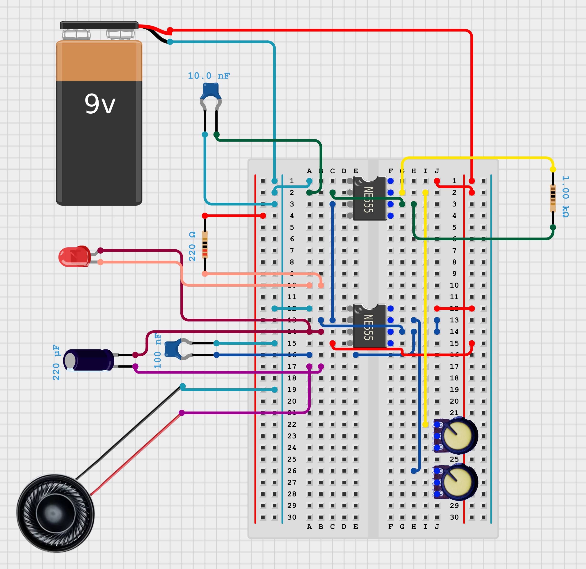
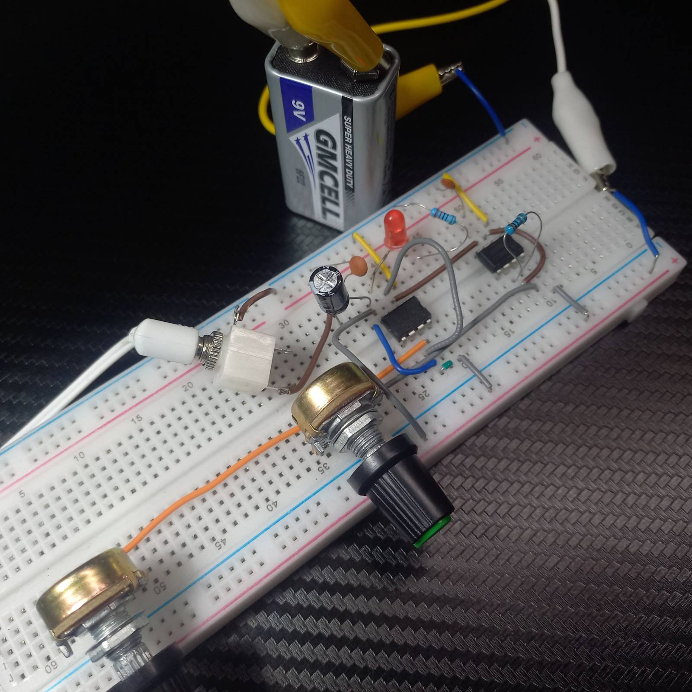

# 🎮 Atari Punk Console — Version 1

My first build of the **Atari Punk Console**: a classic two-555 timer square wave synth running on 9 V.  
This version uses two potentiometers for pitch and pulse width, drives an LED for visual feedback, and outputs audio through a coupling capacitor for fuller sound.

---

## 📸 Schematic

---

## 📂 Project Contents

- **`schematic.png`** – Circuit schematic for breadboard or perfboard
- *(optional)* `layout.png` – Breadboard layout image
- `notes.md` – Component values, wiring notes, and any future tweaks

---

## 🛠️ Components Used

| Component | Value | Purpose |
|----------|-------|---------|
| NE555 timers | 2× | One astable (pitch), one monostable (pulse width) |
| Potentiometers | 2× 500 kΩ – 1 MΩ | P1 = frequency control, P2 = pulse width |
| Resistors | 1 kΩ, 220 Ω | LED current limit and timing network |
| Capacitors | 10 nF, 100 nF, 10 µF, 220 µF | Timing, decoupling, and output coupling |
| LED | 1× | Blinks with oscillator output |
| Power | 9 V battery | Main power source |
| Speaker / jack | 8 Ω speaker or 3.5 mm output jack | For sound output |
| Breadboard & jumpers | — | For prototyping |

> I experimented with different output coupling capacitor values before settling on **220 µF**, which gave a fuller sound with more low-end response compared to smaller values like 10 µF or 100 µF.

---

## 🚀 Assembly & Operation

1. Wire the two 555 timers as per the schematic (astable → monostable).
2. Connect **P1** to control oscillator frequency (pitch) and **P2** to control pulse width (timbre).
3. Power the circuit from a 9 V battery.
4. Connect the output to a small speaker or external amp.
5. Turn the knobs and explore the glitchy square-wave goodness!

---

## 🎛️ Controls

| Control | Function |
|--------|----------|
| **P1 (Pitch)** | Sets the oscillator frequency from low buzz to high squeal |
| **P2 (Pulse Width)** | Alters duty cycle, changing timbre |

---

## 💡 Future Versions

- Onboard LM386 amplifier stage and additional 555 
- Add CV input for external modulation  
- Add photoresistors or touch points for experimental control  
- Explore dual-voice / stereo APC builds  

---

## 📜 License

MIT License — fork, modify, and make noise!

---

## Author
**Jeremy Ray Jewell**  
[GitHub](https://github.com/jeremyrayjewell) | [LinkedIn](https://www.linkedin.com/in/jeremyrayjewell)
