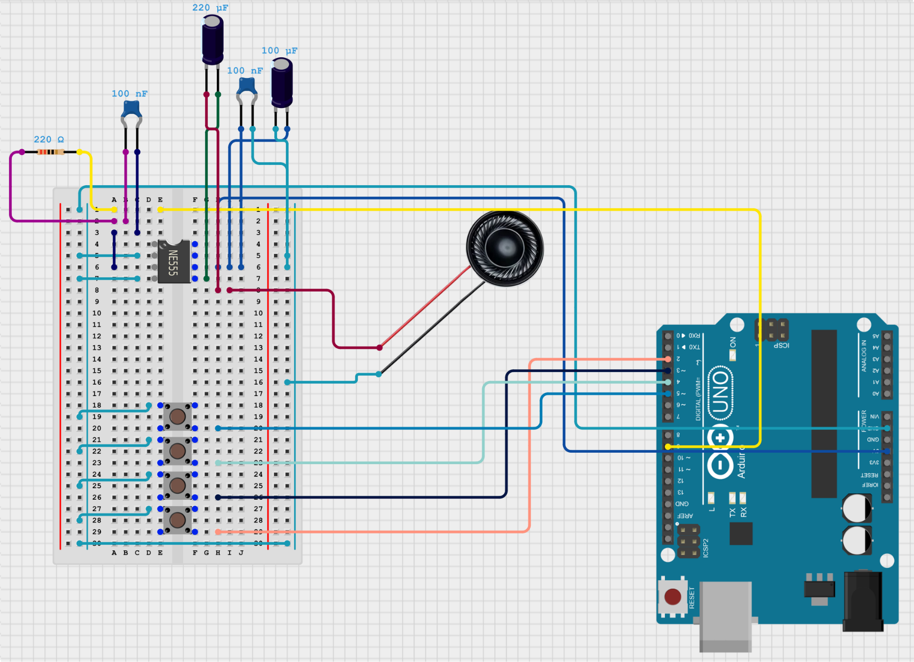

# 🥁 Drum Synth

A simple **Arduino-powered four-button drum machine** with on-board synthesis for kick, snare, hat, and clap.  
Audio is generated via PWM on D9 and amplified with an LM386N + speaker.  

---

## 📸 Schematic

---

## 🛠️ Hardware Setup
| Part | Notes |
|------|------|
| Arduino Uno | Any Uno-compatible board works |
| 4× Momentary Pushbuttons | Kick (D2), Snare (D3), Hat (D4), Clap (D5) |
| 220 Ω resistor | Between D9 and input coupling cap |
| 0.1 µF cap (104) | Input coupling to LM386 IN+ |
| LM386N amplifier | Powered from 5 V and GND |
| 100 µF & 0.1 µF caps | Supply decoupling from VCC to GND |
| 220 µF cap | Output coupling from LM386 OUT to speaker |
| 8 Ω speaker | Any small speaker works |

---

## 🚀 Upload & Run
1. Open `drum-synth.ino` in the Arduino IDE.
2. Select **Board:** Arduino Uno (or equivalent) and the correct COM port.
3. Upload the sketch.
4. Press the buttons and start jamming!

---

## 🔊 Drum Voices
| Pin | Voice | Sound Character |
|-----|-------|----------------|
| D2 | Kick | Sine with pitch drop |
| D3 | Snare | Tone + noise mix |
| D4 | Hat | High-passed noise, short decay |
| D5 | Clap | Multi-burst noise gate |

All voices mix to PWM output on **D9** and share the LM386 amplifier.

---

## 🧠 Future Ideas
- Add a 7-segment display for kit number
- Implement multiple drum kits (button to cycle)
- Add simple effects (phaser/LPF) using remaining pots
- Trigger from MIDI or serial input for external control

---

## 📜 License
MIT License — modify and share freely!

---

## Author
**Jeremy Ray Jewell**  
[GitHub](https://github.com/jeremyrayjewell) | [LinkedIn](https://www.linkedin.com/in/jeremyrayjewell)
